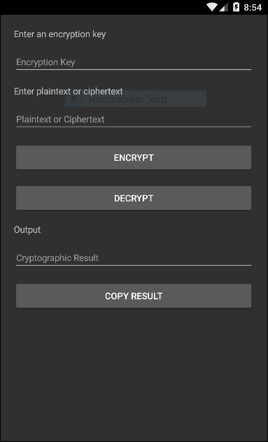

# CryptText3
A simple Android/iOS application to encrypt text with AES-256.

Built using Xamarin.Forms and powered by [PowerCrypt4](https://github.com/exaphaser/PowerCrypt4).

Licensed under the terms of the GNU GPLv3

Now available on the [Play Store](https://play.google.com/store/apps/details?id=com.fireball.CryptText3.droid)!
